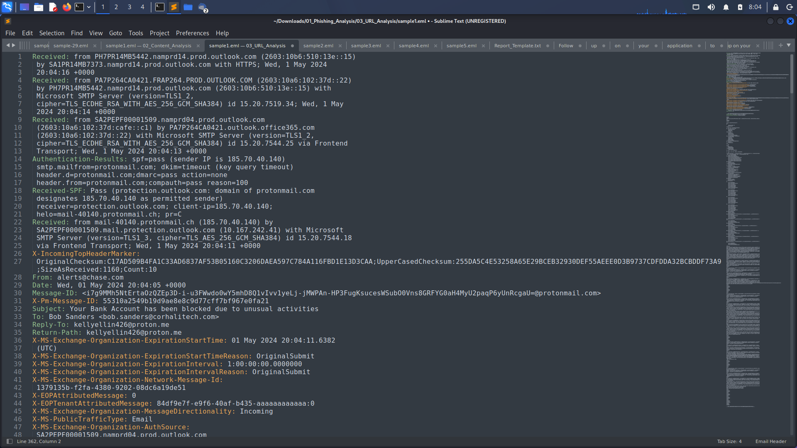
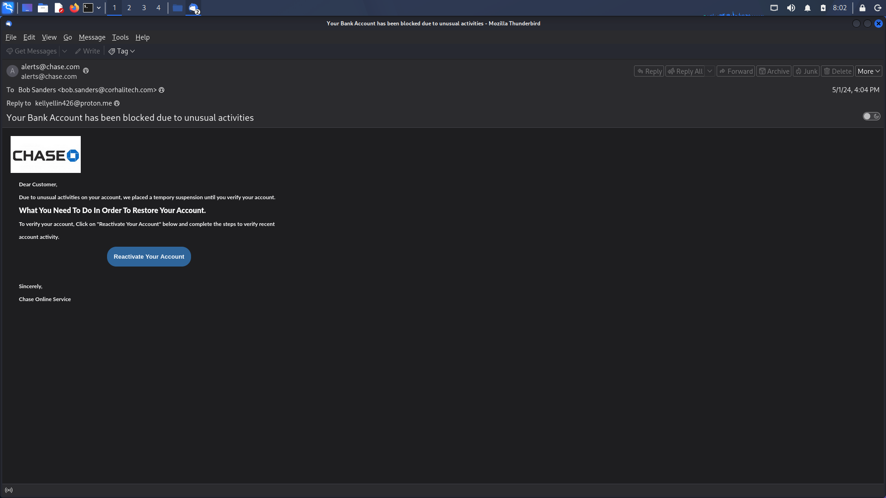
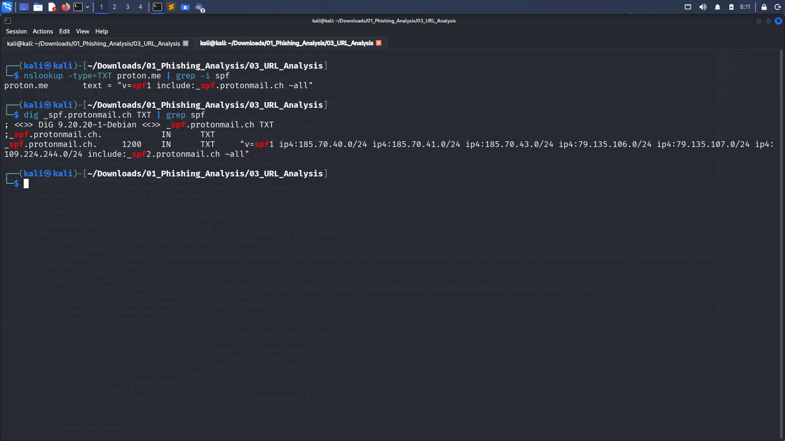
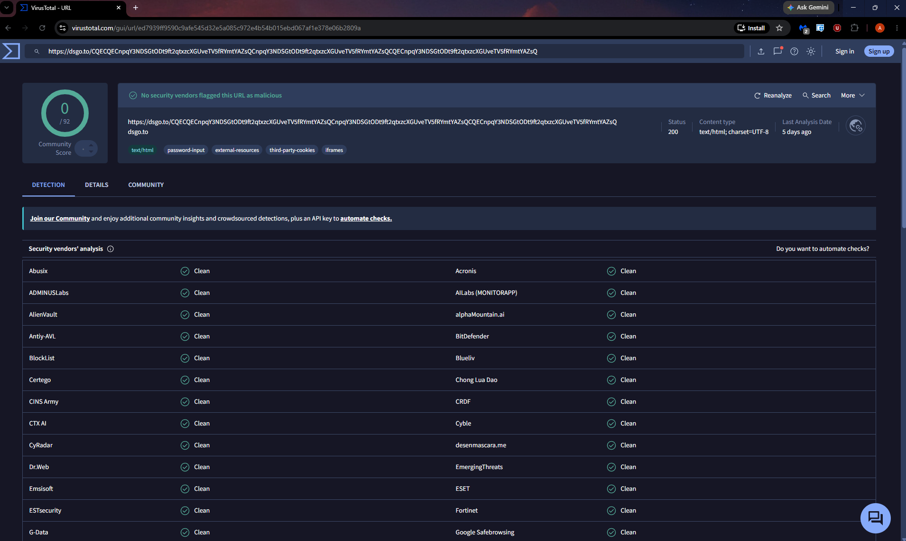
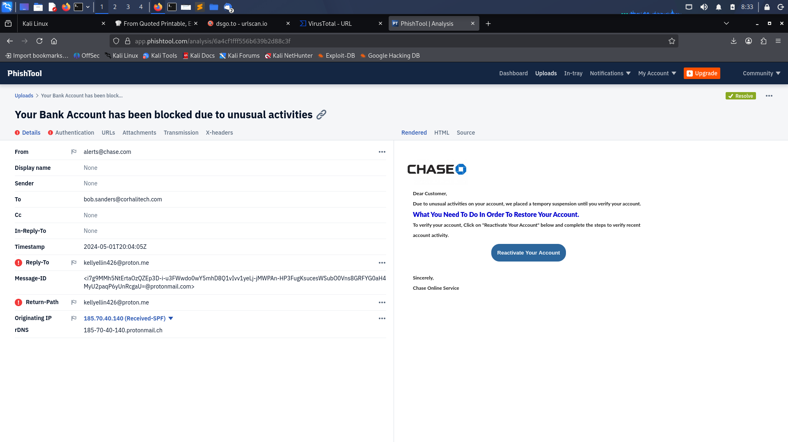

# Chase Bank Phishing Email Analysis

## Overview

This project demonstrates the manual investigation of a phishing email impersonating Chase Bank. The objective was to determine whether the email was malicious by analyzing the email header, sender authentication, email content, embedded URLs, and Indicators of Compromise (IOCs).

---

## Sample Information

| Item | Value |
|------|------|
| Sample | Sample-01 |
| Attack Type | Credential Phishing |
| Brand Impersonated | Chase Bank |
| Target | Bob Sanders |
| Analysis Status | Completed |
| Final Verdict | Malicious |

---

## Investigation Workflow

1. Email Header Analysis
2. Sender Authentication Analysis
3. Email Content Analysis
4. URL Analysis
5. IOC Extraction
6. MITRE ATT&CK Mapping
7. Incident Report

---

## Analysis Screenshots

### Email Header

---

### Email Content

---

### SPF Verification

---

### URLScan

---

### VirusTotal

---

### PhishTank

---

## Conclusion

The investigation confirmed this email is a phishing attempt impersonating Chase Bank.

The attacker attempted to trick the victim into clicking a malicious link and entering banking credentials into a fake login page.

The email should be blocked and all indicators should be added to enterprise detection systems.
