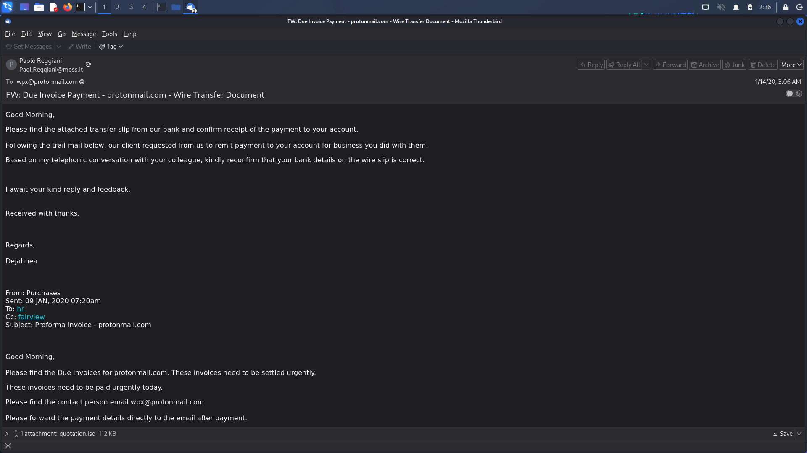
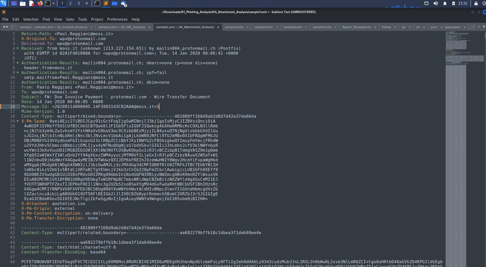
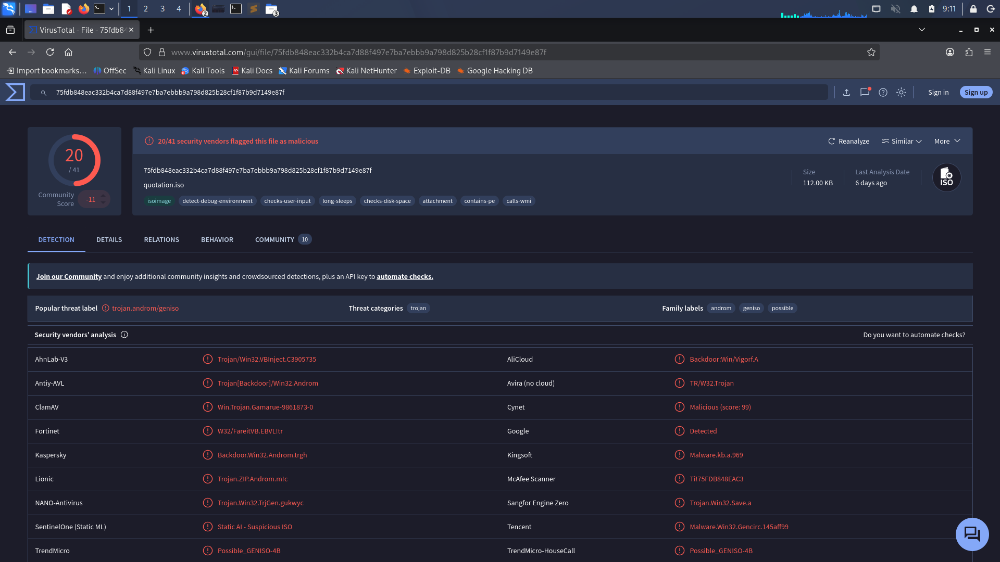
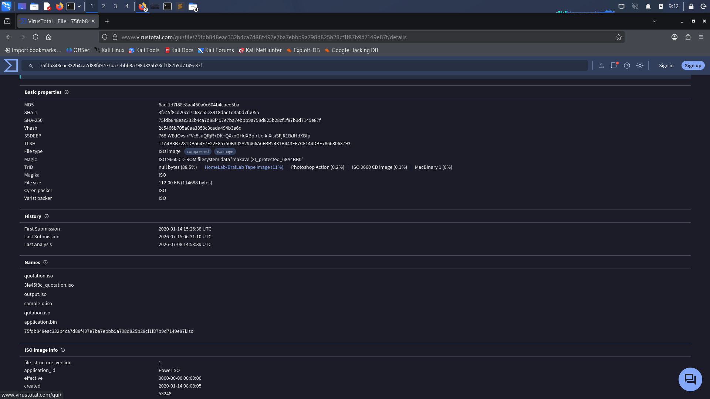
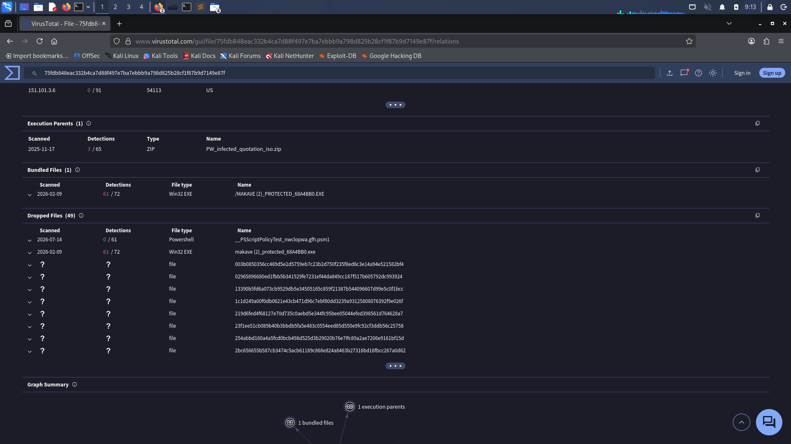
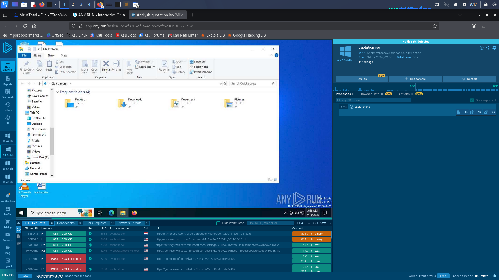

# Sample 02 - Due Invoice Payment Phishing Analysis

## Overview

This investigation analyzes a phishing email impersonating a legitimate business payment request. The attacker used an email with a malicious ISO attachment to trick the recipient into opening malware disguised as a payment document.

The objective was to analyze the email, inspect its headers, examine the attachment, identify Indicators of Compromise (IOCs), and determine the overall threat.

---

## Scenario

The victim received an email requesting confirmation of a wire transfer payment. The email contained an ISO attachment named **quotation.iso**, which claimed to contain payment information.

After analysis, the attachment was found to contain a malicious executable responsible for malware execution.

---

## Investigation Workflow

### 1. Email Analysis

- Examined sender and recipient information.
- Reviewed the subject line.
- Read the email content.
- Identified social engineering techniques.

**Screenshot**



---

### 2. Email Header Analysis

The email header was analyzed to verify:

- Return-Path
- From Address
- Reply-To
- SPF
- DKIM
- DMARC
- Received headers
- Message-ID

This helped determine the legitimacy of the sender.

**Screenshot**



---

### 3. Attachment Analysis

The attached file was:

```
quotation.iso
```

The ISO image contained a malicious executable that executed malware when opened.

---

### 4. VirusTotal Analysis

The ISO file hash was searched in VirusTotal.

Results showed multiple antivirus engines detecting the file as malicious.

**Detection Screenshot**



---

### 5. VirusTotal Details

Reviewed:

- MD5
- SHA1
- SHA256
- File type
- File names
- File history

**Screenshot**



---

### 6. VirusTotal Relations

VirusTotal Relations revealed:

- Bundled executable
- Dropped files
- Parent relationships

This helps understand how the malware behaves after execution.

**Screenshot**



---

### 7. Dynamic Analysis (ANY.RUN)

The attachment was executed in the ANY.RUN sandbox.

Observed:

- Process creation
- File activity
- Network activity
- Overall malware behavior

**Screenshot**



---

## Investigation Outcome

The email is confirmed as a phishing email delivering malware through a malicious ISO attachment.

The attachment contains a Windows executable that is detected by multiple antivirus vendors and should not be executed on production systems.

---

## Skills Demonstrated

- Email Header Analysis
- Phishing Investigation
- Malware Attachment Analysis
- VirusTotal Investigation
- Dynamic Malware Analysis
- IOC Extraction
- Incident Reporting

---

## Tools Used

- Thunderbird
- Sublime Text
- VirusTotal
- ANY.RUN
- Linux
- GitHub

---

## Files Included

| File | Description |
|------|-------------|
| sample2.eml | Original phishing email |
| mail.png | Email screenshot |
| Header_analysis.png | Email header |
| virustotal.png | VirusTotal detection |
| virustotal1.png | VirusTotal details |
| virustotal2.png | VirusTotal relations |
| Anyrun.png | ANY.RUN dynamic analysis |
| IOC.md | Indicators of Compromise |
| Report.md | Detailed investigation report |

---

## Conclusion

This investigation demonstrates a complete SOC analyst workflow for analyzing a phishing email, validating malicious attachments, extracting threat intelligence, documenting Indicators of Compromise, and producing a professional incident report.
